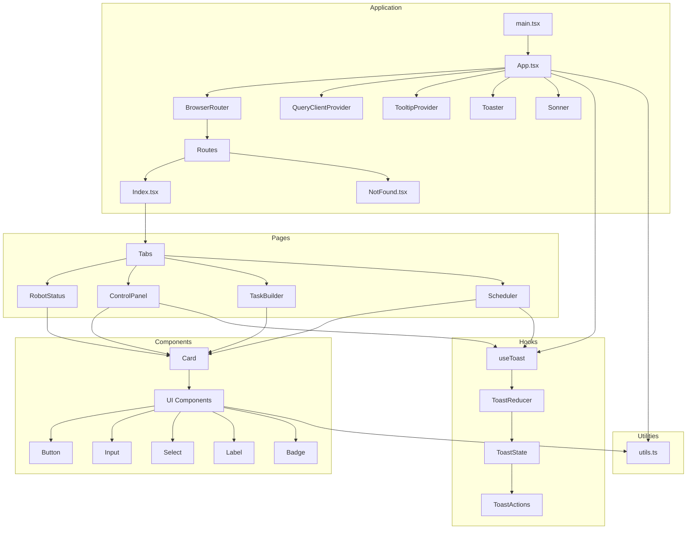

    

    <b>Automatic Architecture Diagrams from Code</b> 
    <a href="https://github.com/swark-io/swark">GitHub</a> • <a href="https://swark.io">Website</a> • <a href="mailto:contact@swark.io">Contact Us</a>

## Usage Instructions

1. **Render the Diagram**: Use the links below to open it in Mermaid Live Editor, or install the [Mermaid Support](https://marketplace.visualstudio.com/items?itemName=bierner.markdown-mermaid) extension.
2. **Recommended Model**: If available for you, use `claude-3.5-sonnet` [language model](vscode://settings/swark.languageModel). It can process more files and generates better diagrams.
3. **Iterate for Best Results**: Language models are non-deterministic. Generate the diagram multiple times and choose the best result.

## Generated Content
**Model**: GPT-4o - [Change Model](vscode://settings/swark.languageModel)  
**Mermaid Live Editor**: [View](https://mermaid.live/view#pako:eNp1VE1v6yAQ_CsW5_b9gBwqNameGql9yquTk90DMdsEFbMWLP1Q1f9ejGOCaXwwYmdGMAxrvliDAtiC1fpgeHcstne1Lgrr9kN523VKNpwk6h4vikcuddX64Q_Zj-fi-vqm11T-C8Ag8lVgntARmGpp8N2CGapM8t-B-VwpCZo2Bt-kADMVbBEVyW6O5JZysEStR2zY82zGJrAN8FoL-NjwA1RhlpwiEf1D-otOi6AbiygFLWo9ia3XnbaK6w-G-f6E97OTrz1SSZxczqxQk0G14RpURm25fV06qWIikSmbIwinRjx1ftnrCtsOtc8_ZhP9DC64EQOT-smoxE_GRD_5Yn4WoN06d5Ai1W6dOBwabumIxn5Mtaf77BzNcCUoaObIB74fY_7FLbmYi-8e8dVOG9BZCI15KYAp9yvRKT1W515_8ks18c4T5Czprw4SQajP9G3T_8z28mF2JJUkCdmBethWrh990z_PhBRUcV12xVow_qUQ_nX5qhkdoYWaLYqaCXjhTlHNvr3IdcL7u5PcO2jZgoyDK8YdYfmpm7E26A5HtnjhysL3DySzioo) | [Edit](https://mermaid.live/edit#pako:eNp1VE1v6yAQ_CsW5_b9gBwqNameGql9yquTk90DMdsEFbMWLP1Q1f9ejGOCaXwwYmdGMAxrvliDAtiC1fpgeHcstne1Lgrr9kN523VKNpwk6h4vikcuddX64Q_Zj-fi-vqm11T-C8Ag8lVgntARmGpp8N2CGapM8t-B-VwpCZo2Bt-kADMVbBEVyW6O5JZysEStR2zY82zGJrAN8FoL-NjwA1RhlpwiEf1D-otOi6AbiygFLWo9ia3XnbaK6w-G-f6E97OTrz1SSZxczqxQk0G14RpURm25fV06qWIikSmbIwinRjx1ftnrCtsOtc8_ZhP9DC64EQOT-smoxE_GRD_5Yn4WoN06d5Ai1W6dOBwabumIxn5Mtaf77BzNcCUoaObIB74fY_7FLbmYi-8e8dVOG9BZCI15KYAp9yvRKT1W515_8ks18c4T5Czprw4SQajP9G3T_8z28mF2JJUkCdmBethWrh990z_PhBRUcV12xVow_qUQ_nX5qhkdoYWaLYqaCXjhTlHNvr3IdcL7u5PcO2jZgoyDK8YdYfmpm7E26A5HtnjhysL3DySzioo)

